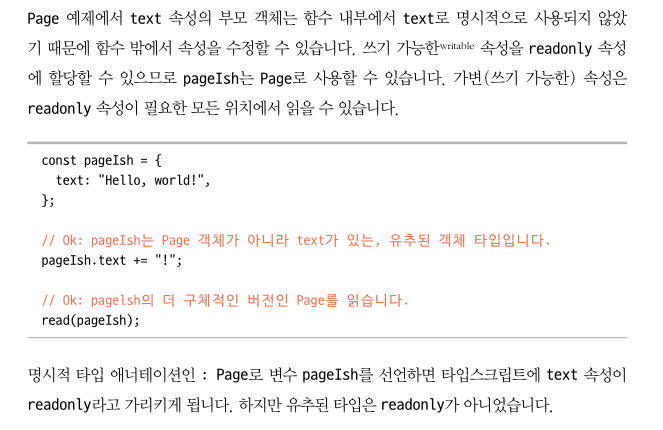
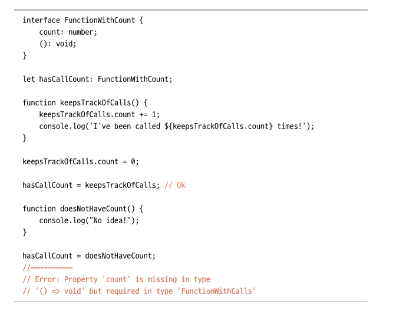

# Ch7. 인터페이스

객체 타입을 다른 방법으로 지정하는 방법에는 인터페이스가 있다.
타입을 객체로 지정해야 한다면 인터페이스를 사용하는 것이 선호된다.

## 7.1 타입 별칭 vs 인터페이스

인터페이스와 타입 별칭을 통한 객체 타입은 거의 비슷하다.
주요 차이점은 다음과 같다.

- 인터페이스는 병합이 가능하다.
- 인터페이스는 클래스가 선언된 구조의 타입을 확인 가능하다. 타입 별칭은 불가능하다.
- 인터페이스가 타입스크립트 성능적인 면에서 빠르다.
- 인터페이스는 이름이 있는 객체로 간주되므로 복잡한 케이스에서 나타나는 오류 메시지를 읽기 편하다.

따라서 되도록이면 인터페이스를 사용하는 것이 편하므로 추천하는 바이다.

## 7.2 속성 타입

### 7.2.1 속성 타입

객체 타입과 마찬가지로 `?`를 통해 선택적 속성을 지정할 수 있다.

### 7.2.2 읽기 전용 속성

`readonly` 키워드를 통해 속성을 읽기 전용으로 만들 수 있다.
새로운 값을 재할당이 불가능하게 된다.


이 부분이 이해가 잘 안됩니다.

### 7.2.3 함수와 메서드

- 메서드 : `member(): 타입` 형태로 타입을 지정
- 함수 : `member: () => 타입` 형태로 타입을 지정

둘 다 `?`로 선택 속성으로 지정 가능하다.

메서드와 속성 함수의 차이점에 대해서는 좀 어려웠습니다.

### 7.2.4 호출 시그니처

호출 시그니처는 인터페이스 내에서 매개변수와 반환 타입을 지정할 때 쓰인다.
호출과 동시에 타입을 지정할 때 쓰인다.


여기에 `FunctionWithCalls`가 없는데 잘못된거일까요?

### 7.2.5 인덱스 시그니처

`[i: 타입]: value타입` 형태로 객체 타입이 가지는 속성의 key와 value의 타입을 한꺼번에 지정가능하다.
인덱스 시그니처를 사용하면 항상 속성이 값을 반환해야 하는 단점이 있다. 이것때문에 해당 속성의 값이 없어 `undefined`인데도 에러가 발생하지 않아 런타임에는 에러가 발생하는 문제가 생기기도 하니 주의하자.

### 속성과 인덱스 시그니처 혼합

인덱스 시그니처는 포괄적인 용도로 전체적으로 타입을 지정할 수 있다. 따라서 구체적으로 속성을 지정하는 것과 혼용이 가능하다.
원시 속성뿐만 아니라 리터럴 속성으로 더 구체적으로 지정도 가능하다.

### 숫자 인덱스 시그니처

객체의 키로 숫자를 허용 가능하다. 인덱스 시그니처의 키로 string 대신 number로 타입을 사용 가능하지만 그 속성의 타입은 포괄적으로 string 인덱스 시그니처의 타입으로 할당 가능해야 한다.

### 7.2.6 중첩 인터페이스

인터페이스는 중첩이 가능하다.
한 인터페이스가 다른 인터페이스를 속성으로 가질 수 있다.

<br>

---

## 7.3 인터페이스 확장

`extends` 키워드를 통해 한 인터페이스에서 다른 인터페이스를 흡수해서 멤버를 복사해서 선언 가능하다.
인터페이스 확장을 잘 사용하면 코드의 반복을 줄일 수 있다.

### 7.3.1 재정의된 속성

유니언 타입의 인터페이스를 구체적으로 하나의 타입으로 재정의할 수 있다.
하지만 범위가 맞지 않거나 할당될 수 없는 유니언 타입의 경우에는 재정의가 불가능하다.

### 7.3.2 다중 인터페이스 확장

`extends` 키워드 뒤에 여러 개의 인터페이스를 한꺼번에 확장이 가능하다. `,`로 연결해서 작성하면 된다.

<br>

---

## 7.4 인터페이스 병합

같은 이름의 인터페이스를 동일한 스코프에서 선언하면 인터페이스가 합쳐진다. 이를 병합이라고 부른다.
하지만 이것을 남용하면 코드를 이해하기가 어려워지므로 되도록이면 사용을 지양한다.
Window와 같은 내장된 전역 인터페이스나 외부 패키지를 보강할 때 사용하면 유용하다.

### 7.4.1 이름이 충돌되는 멤버

병합 시 주의할 점은 병합되는 인터페이스에 동일한 이름의 속성을 선언할 수 없다.
이름 같은 속성은 동일한 타입을 선언해야 한다. 수정이 불가능하다.

단, 동일한 이름을 가진 다른 시그니처의 메서드를 정의할 수 있다. 메서드에 대해서 함수 오버로드가 가능하다.

```ts
interface MergedMethods {
  different(input: string): string;
}

interface MergedMethods {
  different(input: number): string;
}
```
