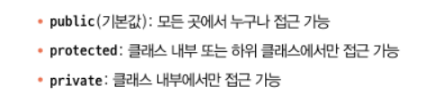

# Ch8. 클래스

# 8.1 클래스 메서드

클래스 내 메서드와 클래스 생성자는 똑같이 인수에 대한 타입 검사를 실시한다.

따라서 메서드나 생성자 함수를 호출 시 인수를 포함하지 않으면 에러를 발생시킨다.

<br>

---

# 8.2 클래스 속성

클래스 내 없는 속성일 경우에는 타입스크립트는 해당 멤버에 대한 추론을 하지 않는다.

속성에 대해서 없는 타입이라고 에러를 발생시킨다.
또한 클래스 외부에서 없는 속성에 대해서 호출하면 마찬가지로 타입이 없다고 에러를 발생시킨다.

```ts
class FieldTrip {
  destination: string;

  constructor(desination: string) {
    this.destination = desination;
    console.log(`${this.destination}`);

    this.nonesistent = desination;
    // Property 'nonesistent' does not exist on type 'FieldTrip'.(2339)
  }
}
```

<br>

### 8.2.1 함수 속성

자바스크립트에서 클래스의 멤버를 호출 가능한 함수로 선언하는 두 가지 방법이 있다.

> 1. `myMethod() {}` 형태로 기본적인 메서드 접근 방식으로 선언하기
> 2. `myProperty: () => {}`와 같이 화살표 함수로 `() => void` 타입으로 선언하기
>    이렇게 선언하게 되면 인스턴스 당 생성하는 시간과 메모리 비용 측면에서 효율적이다. 단, 이 방법으로 선언한 속성은 생성자 함수마다 다른 속성으로 취급된다.

함수 속성에는 매겨변수와 반환 타입을 지정할 수 있다.

<br>

### 8.2.2 초기화 검사

타입스클비트는 `undefined` 타입을 선언된 속성이 생성자에서 할당되었는지 체크한다. 이를 통해서 클래스 속성에 값을 할당하지 않는 실수를 예방한다.

엄격한 초기화 검사가 없으면 컴파일은 가능하지만 JS 런타임 시 문제가 발생한다.

```ts
class Mi {
  property: string;

  // 타입스크립트의 엄격한 초기화 검사가 없다면
  // constructor로 proerty 속성의 값을 할당하지 않으면
  // 아래 length 메서드에서 런타임 에러가 발생하게 된다.
  //   constructor() {
  //     this.property = ''
  //   }
}

new Mi().property.length;
```

<br>

#### 확실하게 할당된 속성

엄격한 초기화 검사를 의도적으로 예외처리하기 위해서는 해당 속성 뒤에 `!`를 추가해서 검사를 비활성화한다.

의도적으로 클래스가 여러 번 초기화될 수 있다면 속성에 대해서 `undefined`를 의도적으로 할당해야 한다.

하지만 엄격한 초기화 검사를 비활성화한다는 것은 타입스크립트의 목적에 맞지 않는 예외적인 경우이다.
따라서 궁극적으로는 클래스를 리팩터링해서 `!` 어서션이 사용되지 않도록 해주어야 한다.

<br>

### 8.2.3 선택적 속성

인터페이스 선택 속성과 마찬가지로 `?`를 추가해서 속성을 옵션으로 선언 가능하다.
`?`를 추가하면 해당 선택적 속성은 타입에 `| undefined`를 포함하는 유니온 타입을 지정한 것과 동일하다.

<br>

### 8.2.4 읽기 전용 속성

인터페이스와 마찬가지로 `readonly` 키워드를 통해 클래스 내 속성을 읽기 전용으로 선언 가능하다.
`readonly` 키워드는 타입 시스템에만 존재하며 컴파일되어 나타나지 않는다.

읽기 전용으로 선언한 속성은 선언 위치 또는 생성자에서만 초기값을 설정 가능하다.
그 외의 곳에서는 수정이 불가능하다.

- 읽기 전용으로 속성을 선언할 때 원시 타입의 초기값을 설정하면 따로 타입 애너테이션이 없다면 좁은 리터털 타입으로 유추된다. 따라서 넓은 원시 타입으로 설정하고 싶다면 꼭 타입 애너테이션을 추가하자.

```ts
class R {
  readonly e: string = 'Hi'; // type: string
  readonly i = 'Hi2'; // type: 'Hi2'
}
```

<br>

---

## 8.3 타입으로서의 클래스

클래스 자체를 변수의 타입으로 지정할 수 있다. 해당 변수는 타입으로 지정한 클래스에 할당할 수 있는 값만 할당 할 수 있다.

<br>

---

## 8.4 클래스와 인터페이스

클래스에 인터페이스를 적용하기 위해서는 `implements` 키워드를 통해 인터페이스 내의 속성 타입을 준수하게 만들 수 있다.

`implements`를 통해 인터페이스를 타입으로 추가했더라도 각 속성이나 메서드에 타입 애너테이션을 지정하지 않으면 `any`로 간주된다.

<br>

### 8.4.1 다중 인터페이스 구현

클래스에 여러 개의 인터페이스를 타입으로 선언하려면 `,`를 통해 개수 제한 없이 적용이 가능하다.

이 때 각각의 인터페이스를 충돌하지 않아야 한다. 충돌하지 않는다는 뜻은 인터페이스 간 같은 속성을 다른 타입으로 선언하지 않아야 한다는 것이다.

따라서 두 인터페이스가 매우 다른 객체 형태를 가진다면 동일한 클래스에 선언하면 안된다.

<br>

---

## 8.5 클래스 확장

인터페이스의 확장과 똑같이 `extends` 키워드를 통해 하위 클래스를 상위 클래스에 확장 가능하다.

<br>

### 8.5.1 할당 가능성 확장

하위 클래스의 모든 멤버가 동일한 타입의 기본 클래스에 이미 존재(포함)할 경우 기본 클래스의 인스턴스를 하위 클래스 대신 사용 가능하다.

<br>

### 8.5.2 재정의된 생성자

자체 생성자가 없는 하위 클래스는 암묵적으로 기본 클래스의 생성자를 사용한다.

하위 클래스가 자체 생성자를 선언하면 `super` 키워드를 통해 기본 클래스 생성자를 호출해야 한다.

타입스크립트는 이 때 기본 클래스 생성자 매개변수의 타입을 올바르게 호출했는지를 검사한다.

또한 하위 클래스의 생성자에서 기본 클래스의 생성자를 super() 통해 호출한 뒤에 this를 통해 접근해야 한다.

<br>

### 8.5.3 재정의된 메서드

하위 클래스의 메서드가 기본 클래스이 메서드에 할당될 수 있다면 동일한 이름으로 새 메서드로 재정의할 수 있다.
이렇게 만든 새 메서드의 타입도 기본 메서드 대신 사용 가능하다.

<br>

### 8.5.4 재정의된 속성

메서드를 재정의하는 것처럼 속성도 재정의가 가능하다. 마찬가지로 하위 클래스는 기본 클래스와 구조적으로 일치해야 재정의가 가능하다.

하위 클래스의 속성을 확장하려고 하면 더 이상 기본 클래스 속성 타입에 할당이 불가능하다.

<br>

---

## 8.6 추상 클래스

하위 클래스에서 특정 메서드 구현이 제공될 것으로 예상될 때는 굳이 기본 클래스에서 구현부를 만들지 않아도 된다.
이 때 사용되는 것이 `abstract` 키워드를 사용한 추상 클래스이다.

추상 클래스는 일부 메서드에 대한 정의가 없는 상태이므로 직접 인스턴스화가 불가능하다.

<br>

---

## 8.7 멤버 접근성

JS에서는 `#` 키워드를 클래스멤버명 앞에 추가해서 `private` 클래스 멤버임을 나타낸다.

TS에서는 각 멤버에 대해서 `public`, `protected`, `private` 키워드를 추가해서 접근성을 제어할 수 있다. 기본값은 `public`이다.


접근성 키워드는 TS에서만 확인되고 컴파일되지는 않는다.

`readonly` 키워드와 함께 적용도 가능하다. 순서는 `readonly`, 접근성 키워드 순이다.

`#`와 `private`는 함께 사용 불가능하다. JS 런타임에서 private는 TS에서도 private이기 때문이다.

<br>

### 8.7.1 정적 필드 제한자

`static` 키워드를 통해 클래스 자체에서 멤버를 정적으로 선언한다.
`readonly`와 접근성 키워드를 같이 사용할 수 있고 접근성 - `static` - `readonly` 순이다.
