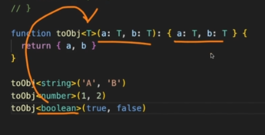

# 제네릭

_~~마지막 제네릭 레쓰고~~_

정리하기에 앞서 지난 영웅님 강의에서 들었던 제네릭을 이해한 내용은 `타입을 파라미터화하여 재사용성을 높이는 것`이다.

```ts
function toObj(a: string, b: string): { a: string; b: string };
function toObj(a: number, b: number): { a: number; b: number };
function toObj(a: boolean, b: boolean): { a: boolean; b: boolean };
// 코드가 길어지는 문제점이 있다.
```



## 제네릭 함수

아래와 같이 사용할 수 있다.

```ts
function identity<T>(arg: T): T {
  return arg;
}

// 호출할 때 타입 지정 << 명시적 제네릭 호출 타입
let result = identity<string>("Hello, TypeScript!");
// T << string이 들어가서 (arg: string): string 형식으로 인식된다.

// 또는 타입 추론 활용
let result2 = identity(42); // 반환 타입은 number

// 아니 근데 화살표 함수 왜 에러나는거
// const identity = <T>(arg: T): T => {
//   return arg;
// };

// // 사용 예제
// let result = identity<string>("Hello, TypeScript!");
// // 또는 타입 추론 활용
// let result2 = identity(42); // 반환 타입은 number
```

### 다중 함수 타입 매개변수

제네릭을 여러개 사용할 수도 있다.

```ts
// 제네릭을 사용한 다중 함수 타입 매개변수
function combine<T, U>(input1: T, input2: U): string {
  return `${input1} ${input2}`;
}

// 문자열과 숫자를 결합한 문자열
const result1 = combine("Hello", 42);
console.log(result1); // 출력: Hello 42

// 숫자와 불리언을 결합한 문자열
const result2 = combine(123, true);
console.log(result2); // 출력: 123 true
```

## 제네릭 인터페이스

인터페이스도 제네릭으로 선언하여 사용할 수 있다!

```ts
// 제네릭 인터페이스 정의
interface Box<T> {
  value: T;
}

// 문자열을 담는 Box 인스턴스
const stringBox: Box<string> = { value: "Hello, TypeScript!" };

// 숫자를 담는 Box 인스턴스
const numberBox: Box<number> = { value: 42 };

// number가 아닌 bool값을 담으려고 하니 에러가 난다.
const errorBox: Box<number> = { value: true };

// 그리고 이러한 제네릭은 역시 유추가 가능하다.
// 유추된 제네릭 인터페이스 타입
interface Box<T> {
  value: T;
}

// 유추된 타입: Box<string>
const stringBox = { value: "Hello, TypeScript!" };

// 유추된 타입: Box<number>
const numberBox = { value: 42 };

// 유추된 제네릭 인터페이스 타입을 사용하는 함수
function getValue<T>(box: Box<T>): T {
  return box.value;
}

const stringValue = getValue(stringBox); // 유추된 타입: string
const numberValue = getValue(numberBox); // 유추된 타입: number
```

## 제네릭 클래스

클래스에서도 역시 제네릭을 사용할 수 있다.

```ts
// 제네릭 클래스 정의
class Box<T> {
  private value: T;

  constructor(value: T) {
    this.value = value;
  }

  getValue(): T {
    return this.value;
  }
}

// 문자열을 담는 Box 인스턴스
const stringBox = new Box<string>("Hello, TypeScript!");
console.log(stringBox.getValue()); // 출력: Hello, TypeScript!

// 숫자를 담는 Box 인스턴스
const numberBox = new Box<number>(42);
console.log(numberBox.getValue()); // 출력: 42
```

확장 역시 가능하다.

```ts
// 기본 Box 클래스 정의
class Box<T> {
  private value: T;

  constructor(value: T) {
    this.value = value;
  }

  getValue(): T {
    return this.value;
  }
}

// 확장된 Box 클래스 정의
class ExtendedBox<T> extends Box<T> {
  private description: string;

  constructor(value: T, description: string) {
    super(value); // 부모 클래스의 생성자 호출
    this.description = description;
  }

  getFullInfo(): string {
    return `${this.description}: ${this.getValue()}`;
  }
}

// 문자열을 담는 ExtendedBox 인스턴스
const extendedStringBox = new ExtendedBox<string>("Hello, TypeScript!", "Greeting");
console.log(extendedStringBox.getFullInfo()); // 출력: Greeting: Hello, TypeScript!
```

## 제네릭 타입 별칭

제네릭 또한 타입 별칭 사용이 가능하다..!

```ts
// 제네릭 타입 별칭 정의
type Box<T> = {
  value: T;
};

// 문자열을 담는 Box 인스턴스
const stringBox: Box<string> = { value: "Hello, TypeScript!" };

// 숫자를 담는 Box 인스턴스
const numberBox: Box<number> = { value: 42 };
```

## 제네릭 제한자

제네릭을 사용할 때 모든 타입을 허용하는 것이 아니라, 특정 조건을 충족하는 타입만 허용하고 싶을 때 사용한다.

```ts
interface Quote<T = string> {
  value: T;
}

let explicit: Quote<number> = {value:123}
let implicit: Quote = {value:"123"}
let miss: Quote = {123}// 에러
```
