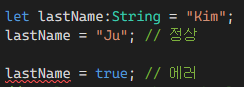
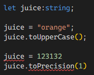

# Chapter2 정리

## 타입의 종류

이렇게 TS가 유추할 수 있는 원시 타입은 JS가 가지고 있는 것과 동일한 원시타입으로 총 7가지이다.<br />
`Undefined`, `Null`, `Boolean`, `Number`, `String`, `Symbol`, `BigInt`

아래와 같은 코드를 통해서 타입스크립트는 singer 변수가 string임을 유추할 수 있다.

```typescript
let singer = "Daft Punk";
```

즉, TS에서 특정한 값을 할당하지 않는다면 TS는 알아서 값을 유추해서 할당한다.

## 타입 시스템

1. 코드를 읽고 타입과 값을 이해한다.v
2. 각 값의 초기 선언에서 가지는 타입을 확인한다. 명시하지 않았다면 할당된 값을 분석하여 타입 추론을 한다.
3. 각 값이 이후 코드에서 어떻게 사용되는지 표기한다.
4. 타입이 일치하지 않는다면 사용자에게 오류를 표시한다.

아래 코드에서 .length() 함수처럼 호출하려고 하니 에러가 나서 에러코드를 확인하면 .length의 멤버는 함수가 아닌 숫자라는 오류를 표기한다.

```typescript
let firstName = "Get Lucky";
firstName.length();
```

### 구문오류와 타입오류

- 구문 오류 : TS -> JS 변환이 차단된 경우
- 타입 오류 : 타입 검사기에서 일치하지 않는 타입이 감지된 경우

### 할당 가능성

타입스크립트에서 할당 가능성(Type Assignability)은 변수나 값이 특정 타입으로 할당될 수 있는지를 나타내는 것이다.

```typescript
let lastName = "Kim";
lastName = "Ju"; // 정상

lastName = true; // 에러
```

아래와 같이 에러가 출력된다.



---

### 타입 애너테이션

TS에서 초기값이 없는 변수는 기본적으로 any라는 타입으로 간주된다. `any타입은 모든 타입을 허용하는 동적 타입이다.` 이러한 any의 문제는 다음과 같다.<br/><br />
아래와 같은 코드가 문제가 없다고 나온다. 즉 타입스크립트를 사용하는 의미를 없게 하는 코드가 발생할 수 있다.

```typescript
let juice;

juice = "orange";
juice.toUpperCase();

juice = 123132;
juice.toPrecision(1);

// 여기에 아래 코드를 추가하면 에러가 뜬다.
juice.toUpperCase(); // 이미 juice = 123132로 number타입의 값이기 때문이다.
```

이러한 것을 방지하기 위해 사전에 타입 애너테이션을 하여 타입을 지정해준다. 그러면 아래와 같이 오류가 출력된다.



그리고<br />
`let first: string = 123;` << 이런 코드는 작성하지 말도록 하자. 바로 에러가 뜬다.

### 타입 형태

타입의 일치 여부 뿐만 아니라 그 이상의 문제점도 알려준다.

```typescript
let rapper = "XXXTENTACION";
rapper.length; // 문제 없이 동작
rapper.push("!"); // string 타입에서 동작이 불가능하므로 에러 표기

let cher = {
  firstName: "Kim",
  lastName: "SeokJu",
};

cher.middleName; // cher객체에 middleName에 해당 키가 없으므로 에러 출력
```

### 모듈

모듈로 선언하면 파일별로 개별의 스코프를 가지지만 그렇지 않는다면 `전역 스코프`에서 공유한다.
따라서 모듈 형태로 코드를 작성할 경우 같은 파일에 import하지 않는 이상 충돌이 일어나지는 않는다.
