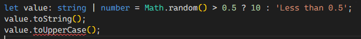
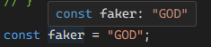
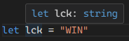
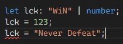

# 유니언과 리터럴

- 유니언 : 값에 허용된 타입을 2개 이상의 타입으로 확장
- 내로잉 : 값에 허용된 타입을 1개로 좁히는 것

## 유니언

`이거 또는 저거 혹은 저런거` 라고 값이 2개 이상임을 나타내는 문법<br />
아래와 같이 버티컬 바 `|` 을 통해서 타입이 여러 개임을 나타낸다. 순서 중요 X

```typescript
let thinker: string | null = null;
if (Math.random() > 0.5) {
  thinker = "Susanne Langer";
}
```

하지만 이런 유니언 타입에는 문제가 발생한다. 아래와 같이 값이 변하는 코드에서 toUpperCase는 number타입에서 쓸 수 없는 문제가 발생하고

```typescript
let value: string | number = Math.random() > 0.5 ? 10 : "Less than 0.5";
value.toString(); // 정상 동작
value.toUpperCase(); // 에러 발생
```

이렇게 오류가 발생한다.



그래서 구체적인 타입을 코드에 알려야한다. 그것이 `내로잉`이다.

## 내로잉

### 값 할당을 통한 내로잉

초기에 값을 할당하고 코드를 실행한다.

```typescript
let myHome: number | string;
myHome = "Suwon";
myHome.toUpperCase();

myHome.toFixed(); // Property 'toFixed' does not exist on type 'string' 에러 발생
```

### 조건 검사를 통한 내로잉

조건문으로 판별한다.

```typescript
let myHome: number | string = Math.random() > 0.5 ? 10 : "Suwon";
if (myHome === "Suwon") {
  myHome.toUpperCase();
}

myHome.toFixed(); // Property 'toFixed' does not exist on type 'string' 에러 발생
```

### typeof를 통한 내로잉

```typescript
// 에러 X
let myHome: number | string = Math.random() > 0.5 ? 10 : "Suwon";

if (typeof myHome === "string") {
  myHome.toUpperCase();
} else {
  myHome.toFixed();
}
```

데브코스 강의들에서 학습했던 수 많은 방어코드, 타입체크의 개념인 것 같다.

<br />

## 리터럴 타입

특정한 원시의 값으로 이루어진 타입<br />
const는 바뀌지 않기에 다음과 같이 바로 리터럴 값으로 인식한다.



하지만 let의 경우 이렇게 값을 바꿀 수 있는데



초기값을 정해서 할당 할 수도 있다.



## 엄격한 null 검사

strictNullChecks 옵션을 켜는 경우 null 이나 undefined에 대한 할당을 제한한다.<br />
` “10억 달러 짜리 실수” 라는 발언은 많은 시스템들이 null 로 인해 얼마나 많은 비용을 발생시키고 있으며 얼마나 많은 개발자들이 이를 안전하게 처리 하기 위해 노력을 들이고 있는지 함축적으로 보여 줍니다.` ~~은행 송금에서 버그로 인해 null이 전달되었다면? 을 상상해보자~~ 라는 TMI

```typescript
// strictNullChecks가 켜져 있을 때
let name: string = "John";
name = null; // 에러: Type 'null' is not assignable to type 'string'.

let age: number | null = null; // 유니온 타입을 사용하면 할당 가능

// 아니면 아래처럼 if문으로 예외처리하자
let myHome: number | string = Math.random() > 0.5 ? 10 : "Suwon";
if (myHome) {
  console.log(myHome);
} else {
  console.log(myHome);
}
```

## 타입 별칭

쉽게 말하면 `타입을 변수처럼 사용`하는 것이다.

```typescript
let firstData: boolean | number | string | null | undefined;
let secondData: boolean | number | string | null | undefined;
let thirdData: boolean | number | string | null | undefined;
// 위 같은 코드를

// 이렇게 간단하게 묶고
type dataType = boolean | number | string | null | undefined;

// 간편하게 사용할 수 있다.
let firstData: dataType;
let secondData: dataType;
let thirdData: dataType;

// 이렇게 결합 혹은 확장해서 사용할 수도 있다. 위치 상관 X
type IdPlus = Id | number | string;
type Id = string | null;
```
