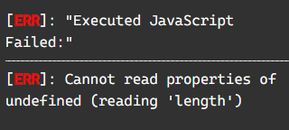
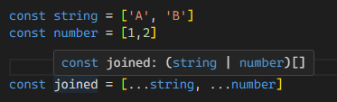

# 배열

TS에서 배열의 타입은 변수의 초기 값으로 지정되거나 아래와 같이 지정할 수 있다.

```ts
let arrayNumbers: number[];
arrayNumbers: [1, 2, 3, 4];
```

## 배열 타입

타입을 선언할 때 유의할 점이 있는데 선언부의 소괄호 여부에 따라서 의미가 크게 달라진다는 것이다.

별 4개

```ts
// 타입은 string 배열을 반환하는 함수
let createStrings: () => string[];

// 타입은 각각 string을 반환하는 함수 배열
let stringCreater: (() => string)[];

// 배열에서도 유니언 타입을 선언할 수 있는데 유니언의 경우도 마찬가지이다.
// 타입은 string 또는 number을 가지고 있는 배열
let stringOrArray: string | number[];

// 타입은 각각 number또는 string인 요소의 배열
let arrayOfString: (string | number)[];
```

예제와 함께 any 배열의 진화 과정을 알아보도록 하자.

```ts
// 타입: any[]
let value = [];

// 타입: string[]
value.push("");

// 타입: (number | string)[]
value[0] = 0;
```

## 배열의 멤버

TS에서 배열 값에 접근하고 해당 값을 특정 변수에 담는다면 그 변수의 타입은 해당 배열의 타입과 동일한 타입을 가지고 있는다. 하지만 이러한 방식에서 예외가 발생할 수 있는데 컴파일러가 예외를 잡지 못한다. 그것을 불안정한 멤버라고 한다.

```ts
function e(e: string[]) {
  console.log(e[9000].length); // 오류 X 하지만 실행하면 오류가 난다.
}

e(["It's", "over"]);
```



## 스프레드 연산자

스프레드 연산자를 사용해서 배열을 결합할 경우 TS에서 새 배열은 기존 두 배열의 유니언 타입의 배열로 인식한다.



## 튜플

고정된 크기의 배열을 튜플이라고 한다. TS에서도 사용할 수 있다.

```ts
// 고정된 튜플 배열 타입 선언
type Point = [number, number];

// 튜플 배열 생성
const coordinates: Point[] = [
  [10, 20],
  [30, 40],
  [50, 60],
  [80, 90, 100], //에러
];
```

### const assertion

변수가 리터럴 값을 가지고 있어 그 값을 변경할 수 없음을 명시적으로 알려주는 문법을 말한다.

```ts
const numberVar = 42; // 타입: number
const stringVar = "Hello"; // 타입: string

const constNumber = 42 as const; // 타입: 42 (리터럴 타입)
const constString = "Hello" as const; // 타입: "Hello" (리터럴 타입)
```

튜플에서 이러한 문법을 사용할 수 있는데

```ts
// 튜플에 const 어서션 적용
const tupleVar = [10, "hello"] as const;

// 각 요소에 대한 타입 확인
const x: number = tupleVar[0]; // 타입: number
const y: string = tupleVar[1]; // 타입: string

// const 어서션을 사용했기 때문에 값 변경이 불가능
// tupleVar[0] = 20; // Error: Cannot assign to '0' because it is a read-only property.
// tupleVar[1] = "world"; // Error: Cannot assign to '1' because it is a read-only property.
```
