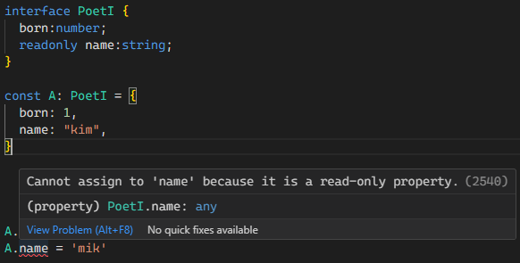

# 인터페이스

일반적으로 많이 선호되는 interface에 대해 알아보도록 하자.
type과의 차이는 거의 없다. 하지만 속도의 문제와 오류의 직관성을 위해서 주로 interface를 많이 사용하고, 타입 별칭을 사용하는 경우는 유니언과 같은 특수한 기능을 사용할 때 주로 사용한다.

```ts
type PoetT = {
  born: number;
  name: string;
};

interface PoetI {
  born: number;
  name: string;
}
```

## 속성 타입

타입과 동일하게 ? 키워드로 선택적 속성임을 알릴 수 있다.
속성 이름 앞에 readonly 키워드를 붙여서 읽기 전용임을 알릴 수 있다.



### 호출 시그니쳐

호출 시그니처(Call signature) 인터페이스 안에 작성하는 매개변수와, 함수의 반환타입을 정의하는 것이다. 매개변수와 반환타입을 정의하는, 함수에 선언하는 타입 애너테이션..인가?

별 5개

```ts
interface User {
  name: string;
  age?: number; //? 기호가 있으므로 선택속성
}

interface GetUserNameI {
  // 이 인터페이스의 경우에는 호출시그니쳐 (u: User) 가 사용되었다.
  (u: User): string;
}
const user: User = {
  name: "Kim",
};

const getUserName: GetUserNameI = (user: User) => user.name;
const username = getUserName(user);
console.log(username); // "Kim" 출력
```

### 인덱스 시그니처

TS에서 객체의 속성 이름과 값의 타입을 동적으로 확장할 수 있는 방법을 제공하는 문법이다.

```ts
interface Car {
  brand: string;
  model: string;
  [key: string]: string; // 문자열 키로 접근할 때 값은 항상 문자열
}

const myCar: Car = {
  brand: "Toyota",
  model: "Camry",
  color: "Blue", // 추가적인 속성, 문자열 키로 접근하면 값은 문자열로 제한됨
  year: "2022", // 추가적인 속성, 문자열 키로 접근하면 값은 문자열로 제한됨
  isGood: false, // 에러
};

const carBrand: string = myCar.brand; // "Toyota"
const carColor: string = myCar.color; // "Blue"
```

### 중첩 인터페이스

인터페이스를 중첩해서 사용도 가능하다.

```ts
// 중첩 인터페이스 예제
interface Address {
  street: string;
  city: string;
  zipCode: string;
}

interface Person {
  name: string;
  age: number;
  address: Address; // Address 인터페이스를 포함한 중첩 인터페이스
}

const john: Person = {
  name: "John Doe",
  age: 30,
  address: {
    street: "123 Main St",
    city: "Exampleville",
    zipCode: "12345",
  },
};
```

## 확장

아래와 같이 인터페이스를 확장해서 재사용 할 수 있다.

```ts
// 기본 인터페이스
interface Shape {
  color: string;
}

// Shape 인터페이스를 확장한 Circle 인터페이스
interface Circle extends Shape {
  radius: number;
}

// Shape 인터페이스를 확장한 Rectangle 인터페이스
interface Rectangle extends Shape {
  width: number;
  height: number;
}

// 객체가 Circle 인터페이스를 따르는 예제
const myCircle: Circle = {
  color: "blue",
  radius: 10,
  //   width: 10, // 에러
};

// 객체가 Rectangle 인터페이스를 따르는 예제
const myRectangle: Rectangle = {
  color: "red",
  //   radius: 10, // 에러
  width: 20,
  height: 30,
};

// 하지만 아래와 같이 재정의 할 때 기존 속성에 할당되지 못할 경우 에러가 발생한다.
interface NullAble {
  name: string | null;
}

interface NotNullAble extends NullAble {
  name: string;
}

interface Combine extends NotNullAble {
  // 이 코드는 에러가 난다.
  // number | string에 string | null을 할당할 수 없기 때문이다.
  name: number | string;
}
```

여러 인터페이스를 사용하여 확장한 다중 확장 역시 사용 가능하다.

```ts
// 기본 인터페이스들
interface Shape {
  color: string;
}

interface Dimensions {
  width: number;
  height: number;
}

// 다중 인터페이스 확장
interface Square extends Shape, Dimensions {
  sideLength: number;
}

// Square 인터페이스를 따르는 객체
const mySquare: Square = {
  color: "green",
  width: 10,
  height: 10,
  sideLength: 10,
};
```

## 병합

인터페이스 병합도 가능하다. 특이한 점은 이름을 그대로 선언해서 속성을 추가하면 된다.

```ts
// 첫 번째 인터페이스 선언
interface Car {
  brand: string;
  speed: number;
}

// 두 번째 인터페이스 선언 (동일한 이름의 인터페이스)
interface Car {
  color: string;
  speed: number; // 이렇게 완전 동일하게 속성 선언은 가능하다
  // 하지만
  // speed: number | null; //이런 코드나
  // speed: string // 이런 코드는 불가능하다.
}

// 인터페이스가 병합되어 brand, speed, color 속성을 가진 하나의 인터페이스가 됨
const myCar: Car = {
  brand: "Toyota",
  speed: 120,
  color: "Blue",
};
```
