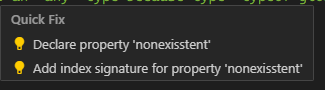
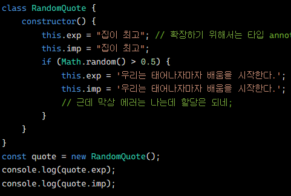

# 클래스

TS에서 클래스 사용은 권장되지 않는다..?

## 메서드

<details>
<summary>독립 함수..?</summary>
<div markdown="1">

타입스크립트에서 독립 함수는 특정 객체에 속하지 않고, 전역 스코프에서 정의된 함수를 의미한다?

특정 개체에 속하지 않고 전역 스코프에 정의된 함수를 가리킨다. 그러므로 함수는 특정 객체의 메서드가 아닌, `독립적인` 존재를 의미한다.

<details>
<summary>함수와 메서드의 차이</summary>
<div markdown="1">

```js
// 독립 함수 예제
function add(a, b) {
  return a + b;
}

// 메서드 예제
const myObject = {
  myMethod: function () {
    console.log("This is a method.");
  },
};

// 함수는 아래와 같이 사용
const result = add(3, 5);
console.log(result); // 8

// 메서드는 아래와 같이 객체의 메서드 호출 방식으로 사용
myObject.myMethod();
```

</div>
</details>
</div>
</details>

대부분 반환 타입의 유추가 가능하다.

## 클래스 속성

TS에서 클래스의 속성을 읽거나 쓰려면 클래스에 `명시적`으로 선언해야 한다.

```ts
class FieldTrip {
  destination: string;
  // nonexisstent: string; // 하지만 선언해준다면 에러는 사라진다.

  constructor(destination: string) {
    this.destination = destination;
    console.log(`Goto ${destination}`);

    // 아래 코드는 Element implicitly has an 'any' type because type 'typeof globalThis' has no index signature. 라는 에러가 난다.
    this.nonexisstent = destination;
  }
}
```

IDE에서 제공하는 해결법도 위처럼 상단에 명시해주는 것이다.



이렇게 명시적으로 선언해야 TS 클래스 인스턴스에서 무엇이 허용되고 허용되지 않는 지 빠르게 알 수 있다.

### 함수 속성

메서드 접근 방식은 함수를 클래스 프로토타입에 할당하므로 모든 클래스 인스턴스는 동일한 함수 정의를 사용한다. 무슨 말일까 ?? 를 띄우다가 예제를 보니, 결국 WIthMethod를 여러 번 새로 생성해도 그것들이 가르키는 myMethod는 동일한 메서드를 가리킨다는 것이다.

```ts
new WithMethod().myMethod === new WithMethod().myMethod; //true란다.
```

### 초기화 검사

엄격한 설정이 활성화되면 TS는 각 속성이 생성자에서 할당되었는지 확인한다.

```ts
class WithValue {
  immediate = 0; // 아예 할당연산자로 0을 할당
  later: number; // constructor에서 사용
  mayBeUndefined: number | undefined; // 얘는 undefined 여도 허용
  unused: number; // 아무것도 없으니 에러 | undefined를 붙여주거나 아래에서 선언하면 된다.

  constructor() {
    this.later = 1;
  }
}

class MissingInitializer {
  property: string;
}

new MissingInitializer().property.length; // 엄격한 모드가 아닐 시 컴파일 되지만 자바스크립트 런타임에서 에러가 난다. 10억달러짜리 실수!!
```

반대로 엄격한 검사를 오히려 비활성화 해야하는 경우도 발생하는데 그럴때는 해당 값이 null 또는 undefined가 아님을 단언 ! 키워드를 사용한다.

```ts
class ActivitiesQueue {
  pending!: string[];

  initialize(pending: string[]) {
    this.pending = pending;
  }

  next() {
    return this.pending.pop();
  }
}

const activities = new ActivitiesQueue();
activities.initialize(["123", "456", "789"]);
activities.next();
```

### 선택적 속성

있을 수도 있고 없을 수도 있음을 나타내는 ? 키워드도 사용 가능하다. 앞선 예제를 다시 보면

```ts
class MissingInitializer {
  property?: string; // ? 를 추가하면 아래에서 에러가 난다.
}

new MissingInitializer().property.length; // 에러!!, Object is possibly 'undefined' undefined일 수 있기때문에
new MissingInitializer().property?.length; // 하지만 이 코드는 정상 동작
```

### 읽기 전용 속성

앞서 학습했던 내용과 마찬가지로 readonly 키워드를 붙일 수 있다.

```ts
class Quote {
  readonly text: string
  constructor (text: string){
    this.text = ''
  }

  emphasize() {
    this.text = '!' // 에러
  }
}
const quote = new Quote('모든 학생들 안에는 뛰어난 아이가 갇혀 있다(잠재력이 있다는 영문 표현)')
quote.text = "근데 언제 풀려나냐고" //에러,  readonly 이기 때문에.

--------------------------

class RandomQuote {
  readonly exp: string = "집이 최고" // 확장하기 위해서는 타입 annotation이 필요하다.
  readonly imp = "집이 최고"

  constructor() {
    if(Math.random() > 0.5){
      this.exp = '우리는 태어나자마자 배움을 시작한다.' // 문제 없음

      this.imp = '우리는 태어나자마자 배움을 시작한다.' // 에러 Type '"우리는 태어나자마자 배움을 시작한다."' is not assignable to type '"집이 최고"'
      // 근데 막상 에러는 나는데 할당은 되네;
    }
  }
}

const quote = new RandomQuote();
console.log(quote.exp);
console.log(quote.imp);
```

하지만 string으로 확장하기 위해서 선언해주고 안해주고 차이에서 TS가 에러를 출력해주지만 실행은 정상적으로 됐다. 왜냐하면 JS코드로는 아래와 같이 바뀌기 때문이다. 이런 확장은 자주 쓰이지 않지만 유용할떄가 있다.



## 타입으로서의 클래스

말 그대로 타입처럼 쓸 수 있는 그런 느낌이다.

```ts
class Teacher {
  sayHello() {
    console.log("모험을 해보라");
  }
}

let teacher: Teacher;

teacher = new Teacher();
teacher.sayHello();

teacher = "Waaa"; // 에러, Teacher클래스가 아닌 다른게 할당돼서.

---------------------

class SchoolBus {
  getA() {
    return ["magic", "shapeshifting"];
  }
}

function wSB(bus: SchoolBus) {
  console.log(bus.getA());
}

wSB(new SchoolBus()); // 스쿨버스 클래스를 통째로 넣어주기

wSB({
  //객체 getA를 주는데.. return의 형식이 같으니까 에러가 안나고
  getA: () => ["transmogrification"],
});

wSB({
  // 얘는 형식이 다르니까 에러가 나는건가..?
  getA: () => 123,
});
```

## 클래스와 인터페이스

인터인터페이스로 class에 타입 할당하기

```ts
interface Learner {
  name: string;
  study(hours: number): void;
}

class Student implements Learner {
  name: string; // 필요한 string 선언
  constructor(name: string) {
    this.name = name;
  }
  study(hours: number): void {
    // study도 선언, 매개변수 타입 number, 반환값 명시 안하면 void 알아서. 명확하게 하기 위해 붙여줌
    for (let i = 0; i < hours; i++) {
      console.log(`studying`);
    }
  }
}

class Slacker implements Learner {
  // 에러가 난다. 왜냐하면 아무것도 없기 때문이지
}}

class Stu implements Learner{
  // 아래 코드들도 에러가 난다. 왜냐하면 타입 어노테이션을 지정하지 않았기에 any로 타입 유추를 하기 때문에 지정한 Learner와 값이 달라진다.
  name;
  study(hours){}
}
```

### 다중 인터페이스 구현

클래스에서도 역시 다중 인터페이스를 구현할 수 있다.

```ts
interface Graded{
  grades: number[]
}

interface Reporter{
  report: () => string;
}

class ReportCard implements Graded, Reporter{
  grades: number[];
  constructor(grades: number[]){
    this.grades = grades
  }

  report(){
    return this.grades.join(", ")
  }
}

class NONE implements Graded, Reporter{
  // 얘도 당연히 에러..
  // 안에 아무것도 없으니까
}

-----------------------------------------

interface AgeIsNum {
  age: number;
}

interface AgeIsNotNum{
  age: () => string;
}

// 동일한 이름을 서로 다른 타입으로 선언해서 이것도 저것도 만족시키지 못해서 결국 에러가 난다. 라고 이해했다.
class AsNum implements AgeIsNotNum, AgeIsNum {
  age = 0;

  age() {return ''}
}
```

## 클래스 확장

클래스를 확장하거나 하위 클래스를 만드는 것에 타입을 추가해보자

```ts
class Teacher {
  teach() {
    console.log("규율이 중요하다.");
  }
}

class StudentTeacher extends Teacher {
  learn() {
    console.log("오픈 마인드");
  }
}

const teacher = new StudentTeacher();
teacher.teach();
teacher.learn();
teacher.other(); // 에러 에러 에러, 없는 값이다.
```

할당 가능성 확장. 상속에서도 사용할 수 있다!

```ts
class Lesson {
  subject: string;

  constructor(subject: string) {
    this.subject = subject;
  }
}

class OnlineLesson extends Lesson {
  url?: string;

  constructor(subject: string, url: string) {
    super(subject);
    this.url = url;
  }
}

let lesson: Lesson;
lesson = new Lesson("coding");
lesson = new OnlineLesson("coding", "oreilly.com");

let online: OnlineLesson;
online = new OnlineLesson("coding", "oreilly.com");
online = new Lesson("coding"); // 에러, 이 변수는 url까지 필요한 타입이다. 하지만 이때, 위 url의 타입을 지정할 때 ? 키워드를 넣어주면 선택 속성이 되므로 에러가 사라진다.
```

재정의된 상속자에서 인수를 잘 부여해서 기본생성자를 올바르게 호출하지 않으면 타입오류가 발생한다.

```ts
class Lesson {
  subject: string;

  constructor(subject: string) {
    this.subject = subject;
  }
}

class OnlineLesson extends Lesson {
  constructor() {
    super("subject");
  }
}

class OffLineLesson extends Lesson {
  constructor() {
    // 이건 JS의 문법에서도 에러나는거 아닌감...
    super(123);
  }
}
```

그리고 코드 순서도 중요하다. super()를 호출하고 사용해야한다. 아래 코드는 에러가 난다.

```ts
class Lesson {
  subject: string;

  constructor(subject: string) {
    this.subject = subject;
  }
}

class OnlineLesson extends Lesson {
  url?: string;

  constructor(subject: string, url: string) {
    this.subject = subject; // 순서 바꾸면 오류난다. super를 호출하기전에 잘못 참조하기 때문이다.
    this.url = url;
    super(subject);
  }
}
```

재정의된 메서드

```ts
class GradeCounter {
  countGrades(grades: string[], letter: string) {
    return grades.filter((grade) => grade === letter).length;
  }
}

class FailureCounter extends GradeCounter {
  // 반환타입과 매개변수가 동일해서 문제 X
  countGrades(grades: string[]) {
    return super.countGrades(grades, "F");
  }
}

class AnyFailureChecker extends GradeCounter {
  // 당연히 반환타입이 달라지므로 에러
  countGrades(grades: string[]) {
    return super.countGrades(grades, "F") !== 0; //에러, boolean이니까
  }
}

const counter: GradeCounter = new AnyFailureChecker();

const count = counter.countGrades(["A", "C", "F"]);
```

## 추상 클래스

추상화 클래스.

```ts
abstract class School {
  readonly name: string;

  constructor(name: string) {
    this.name = name;
  }

  abstract getStudentsTypes(): string[];
}

class PreSchool extends School {
  getStudentsTypes() {
    return ["preschool"];
  }
}
class Absense extends School {
  // 아무것도 없으면 에러가 난다. 왜냐하면
  // 최상위 School에 존재하는 getStudentsTypes를 구현해야한다. 따라서 에러를 발생시키지 않으려면
  // 아래처럼 getStudentsTypes를 선언해줘야한다. quick fix 제공.
  // getStudentsTypes(): string[] {
  //   throw new Error("Method not implemented.");
  // }
}

let school: School;
school = new PreSchool("유치원");
// 추상 클래스는 클래스의 세부 사항이 채워질것이라고 예상되는 프레임 워크에서 자주 사용된다.
// 아래 코드는 하위 클래스가 아닌 최상위 클래스를 직접 사용해서 에러가 발생한다.
// 이 부분은 추상화 클래스에 대한 지식이 더 필요하겠구만....
school = new School("어딘가");
```

## 멤버 접근성

알다시피

- public(default): 누구나 접근 가능
- protected: 클래스 내부 또는 하위 클래스에서만 접근 가능
- private: 클래스 내부에서만 접근 가능

총 3가지의 접근성이 있다. 그리고 자바스크립트는 클래스 멤버의 이름 앞에 # 키워드를 추가해 private이라는 것을 명시한다.

```ts
class Base{
  isPublicImplicit = 0;
  public isPublicExplicit = 1;
  protected isProtected = 2
  private isPrivate = 3;
  #truePrivate = 4;
}

class SubClass extends Base {
  examples() {
    this.isPublicImplicit;
    this.isPublicExplicit;
    this.isProtected;

    this.isPrivate // 에러, 접근 불가

    this.#truePrivate // 에러, 접근 불가
  }
}

new SubClass().isPublicExplicit
new SubClass().isPublicImplicit
new SubClass().isProtected // 에러, 접근 불가
new SubClass().isPrivate // 에러, 접근 불가
new SubClass().#truePrivate // 에러, 접근 불가

------------------------------------

class TwoKeywords {
  private readonly name: string;

  constructor() {
    this.name = "Kim"
  }

  log() {
    console.log(this.name)
  }
}
const two = new TwoKeywords()
two.name = "Lee" // 에러
```

타입스크립트의 멤버 접근성은 타입 시스템에서만 존재하는 개념이지만 자바스크립트의 private은 런타임에서 존재한다는 `큰` 차이가 있다. 단순히 private, protected로 선언되어도 추후 JS코드로 컴파일하면 public으로 컴파일되는데 # 키워드를 사용하면 진정한 private로 사용이 가능하다.

?? 이해 안되는 텍스트 `타입스크립트의 이전 멤버 접근성 키워드를 자바스크립트의 # private 필드와 함께 사용할 수 없다는 점을 기억하세요` 걍 두개를 같이 쓰지 말라는건가?

#### static 키워드

static으로 클래스 자체에 멤버를 선언해보자. static과 readonly, 접근성 제한자를 잘 사용하면 외부에 의해서 접근되거나 수정되는 현상을 막을 수 있다.

```ts
class Question {
  protected static readonly answer: "bash";
  protected static readonly prompt = "니가 제일 선호하는 언어가 뭐야?";

  guess(getAnswer: (prompt: string) => string) {
    const answer = getAnswer(Question.prompt);

    if (answer === Question.answer) {
      console.log(`OK`);
    } else {
      console.log("Wrong!");
    }
  }
}

Question.answer; // Property 'answer' is protected and only accessible within class 'Question' and its subclasses.
```

[8장 실습 코드](https://www.typescriptlang.org/play?#code/PTAECUFcBsFNQFykCdDhWocALjpAOC6QKT2BBxwBdHAcQdGACpRyxAdDtEDZuwGXHAMmcBrOgGlEBaGwAN7RAficC4g5hChANQOBKsYBQFKQGNoAQwDOy0AHEATrFgAXWJoDeU0GTCARUcAZ7YAEx0IEwawC7joACoBlUApXKSgEebQgAYXAUPHAEXHQQAJBwA7RwA1VwAOa8QlQQAAawFKmqMATppNQAHNtPQAKADtFAFtYJGVdTQBLAqyASmNTUzkAewLlFrgAOmgWrLyAAwASQyLSgF9OABMW0ABPFshNUArIADM1gEIBuszxqX2pAtgAdw1c-U08uq6cnV08gCIAaSrix92ZMEJAG-aAflAgE+mwAPo4AI9dAv04gUApB2AJBqnIARVcAKWOAHVXAA7NoEAY6OABjrQIAZVsAHN2EI6nc73AzXW4Xa5SahSGTkeRKVRkvSwKagRoeNoVTSQOS6FpXUqqRRZMqgVyVGr1LnNHmdWA9PqDACCaiqoEU0BOijmamUeqQIxFhvF4x2ewO9OOZy05KmT1e70+onwtkAm82AH3GSXaLuyaXSGaAmV5QAAxKqwaBTZzVAAOnMyU1gFRqil0VTa5WltQA3JlRAU2rAAB5VVT6Aq6HPVfNmUBRQADk4AZzvCEUALquAAEm0oAXLohP0AKU3iQA+7YARybSXXp8valX5gquKbTRUz2ZWudlmVMugAFhWukvMyuswVQABeUCH9OrgoFprc9qK5X9AbqFqC0AjK-HtoW3b3wswAAUTgUpq1AN542gKo5CqXRoDmUAdxULVTwAckUAo5jQ0BdDmeN4AAI1gORFEgZR4DwgjQDQqjYBaNZsl6QjtWcPdlBw5C1GLCCChTUsViqLIVyWJVQBHYdfkSUBAByGyct1w9iumLY5y0rWBwIvb8MxPO9QH2Q5WlnXCE3PUBbQjKMYzjKp4zyNDABvRwBI1bQ3ZpXjA9UyPHS2gLL5QCcQAVecAHZbQEAW9HAB2h0AAAVNBaAjNDwmiVLLCsKg03QcJmVNzPfUBUoqUA2lw-D4DQyNo1jBM0K6AdpLkqdREAHTHAAWGgFAAlRwhQEAUK6Io7QAVFsAGJqsUAHnHAAmmwAZOoAPykdzlJLNT0urWlgHpWRPBZAB1OCdwAWT0HcWg5LlijmfbdyO64kytQ4LO23dzsOx0blOx6jvPM8Lzuna3uerpXoO96QDneB5NDLadti+KDDwk65ihhK8L+JArrPAA+TlxgbP4AQcQAHGtAJqB0ACobOEAVjHABVBwAERtAQAShcAGbHgsAD3HQABQAfTtAQBM3oc-hJrq0B2oawmvQmv5rV9UB7r2wG-oBi6OU+r7SSlhGYbmSlTtVxLENENZtQo0B5KDdbmTUFW4sR+HFE0Eo2SMTJdEUABrVNout23LjUC88hqeNIBrQiWkVTC6nPDHff91nQEeABNVNHkQaOADkWkecWjMKmoKkwuR4CVs5zeh7W3Zt0pLmuPys8dgpc66R2XeUEuPYMZQ8hBupK9nHOlXr133bLlv7IARgAJgAZlchsQXBSEAsAHAnQEAGqHF4CwAH9tAQAQGsAC6aUVAELhwcDtpI3o3VoZcGzZ2gA1bVIHgLk3lKKYqgzPPQAABjzBtzEACDHQEAA1WQSAAaBwACeN0HfqEQBmQlCXCQAUSAxRiKaC-qIDOc4BRChIPETIxQ9QACFYAAFU+KwDWDUdkcCEFINAAAH1AJAEhZDjhTBQWAQAGaPDgYSmJh7JQAOT8IACdXpCmAYeRCh5kqEGFAKw0A5hAAs3YAYJq-CYnGgOWh9DGHkKmBzbm-A8aAAyG2RlgsGRCiP2QAOC1gxnLyecQorpykUvuGBUiLxDxumtMAG01C7TSjKAAkgUOCL9oIAC8pHGFEKYeMFs1a1hlAWUQhwiykh8aofxgTMzaiqGEq4NxolFzwj0DSWRdwNkACOjgBKmt3oACq7grSXMIABabQBRUAC9zgAYZa9KAQAGC2tlACAwAKD2ABKhwANguAF7OwAHUugFXv4QAIeNYKkrJScoAh7v0AK2jgAbpp+IAHcnWAoEABhDmxNj0i8aAVJyh0lBKyTkpMUSYna2RuuOsWQZHs1AIAFNnEhmKMfMn49V5K3RSb42oATLmhIpHku5hS4C1FKaIX4hzOAAHlCIACsSK6AgmoeMLQ0mEQQjRLhpCtE4UJTwqYnS9mgEABHj2JCTEgsmci5mSwW5K6Pky2fwikwp3A2ZsbYgrBWHIAVAnACDA6AD0gBE8eOabUAqoBRVAAG5BNTAARTvnfG5oACJ8RlJsOJtQADaABdacvFQXZNgHkbVz9aj6qyMahoCldz7mtTKMyrrahWkyKpB4ocHHaF0EsU8zrlBso0jarIbL4o0lMAZY5PIMWKHlUqzMOV86yuTcq5QarYB3wrlIJNmYU1RlDTUc1YS8gGrQqPCenA0IABYACsAA2NCdaADsAAOAAnGhI1uxC2KqzcpMsvqVprUZCctV7576ZG0IoGYBR8X6FLDWR5MpMhoL5Bg5YbdR12sdfeENddR1mTQmhL1phYDFHjFxC19inVKRXRii8aFNg4ThT8dx8gE2gAAI6QBnWZCy079D2WqYAA5bQCAE1VwAuwOABOWgWhBhyAAe2wALaMyVkQ4aSgBwGsAABr1K0h5EAAXjgAa8ehE4KlaRhyAEAxgkoBAA6K4AEDW6iuSkABmdJ7V1mUeIAH9qMQRAXvowAJGMtRiAnEAs9QDzsXfihwuI6VTmNpOmV4BMIzGKKB2dpgZNtHxWWeMdqeOAEXJpwgAdWfEw2QAqmuAFLxqIuJ8AdmIMOIIqFiyOxvIiJE6Qpw6dgAuvTiFIImfM+J01W7bG5M1aYKoaw8i7QzDuLoNs+ItGKFdDG78uiNsPfeRxoaDNnsAA1jrBhyAB2FtD+iQGAAnOkBoBAAMPYAAbHQgRQlSiScH6wAEgXpiRgpqj1KWC6+kr5XKs1bq01lrbWOsNl+C4UqNFHgjdABVqrtWGvNeadNrojwcIVlyomtJwlFB4sorMOii3TOgAs7thSphRD8dAIASc6xW-GHPowcGJAGYC6YAEka9Kxu-Wg-9gH9DAdJGp1LmnQeWo7j+x83Rej9A4-oLoBm4cZyfEjvIKOlSQTh8pi+Lh-NyB3OEzIho5gAAloy9AffeTHiOVRoWqYADdXQgdkAC89I42OA8OHADF+gk1k80EgZwJORd+SF6Tlx5lSTi+F+C2aEuDBdEpzT6AdPPjS5F2ezaigDedYHJwBXMvNCABcFywgz6mABmmw2gAPTuGoAwAP83ECnCc1wpOg7QDweRTV4pdCqnp00ANQbQAGseLgrIMFHicEeMoZCBEE+xaPFkR4Jq+f0jWAw+VxUTiuDwXkQi5EkCe8Op0X3yhcuM6VNj4voaA9B7qLsQ4+fC8WTL97yv1xQ6iEGYAC-nAAhPYM0AlvBkc0AK2LgAPyboIAYka0P8GxPSNveRDBmEALg1gAWmeyHoVUHN+Cfa6LVUPmgCiAA1x0AgBUNcALtDTg7DjQmvzdq+iYiZEbyjUO6Nw+PEqJhZQxQ+hqgyFSIbx08DhPgV819RAOEr9b9DZAAXTr5gWQ+0ABcaxII-MWUwd-UAVGDGGtcA8dc+GoS4PWXOUAAAGX81P3J1MDGAlF5HiQp0DSmHVkOiWGUEoUQQMDqCQAVRaCqBYXThlSlEgBTHAkglAgyjUEoOtmOHtloNtjtRkWRF3gYNqHbE3QTW3QXEKEUPXVqFy23CUjoOA1titFMFWBYLyDYM0A4IkS4M0B4L4IEM5AbEsLmD8EiE4EABPOwAHBrAABnspVc3gQcM4EAAwewADTXYQeoop2ovlnCORAAZUfMDdx6isyiGGns1AEcy5gckABhJhSNYOxAXCCMyT+UogAHiQkWFsK-iqAAGp6jDCmga9nxBh3CZRLR7x9hM8idXAlA5AXZlgJDr0pCKCqC5CuRP0-lapWovl5ElEsQFMCQHAmwhCwwRCIIb1JDqxpCJiDApiLBLA95gp4M-AFkhY5j+xXM0NAAPRsABlFhwQADUHQgmwhVmxQBAApUcAA1R7ELqTCOYOgVzQAAnG3kOYsi6VQA3jd4ZDqDNBbB4RQB1lxx5IFDSg9J3DrCaiq9DA41CdiCDBSD4AtAF12QuQchSS7CQikFjVxYCTNAiSIBYBsVEoDi51mShQ11cD9Dnl1iWRwAOTEoABha2DkEYsCXQNQEklMKYTgAUlky4ckm2JcTgmko1PSCLHdPICklU+wtU5o49HUtNbIZU1MS9aTQU31f1PQMPQ0000NFFfggoJ4OPf8fSPktQJORFJOICLYqCUY3Y84Uk2UpkhUtk+7dhPwaeAcI-cWKQekxk1UcUPxZQJOBBTVMUCUakgwAsQ4BMpNeAJM2AFMlOXQNM4oLkTMj-MOHk3M6VMMdUcsv0nYyU2VZM1M98cszgIsks9Mys8UMovyUwTM+xE-dCNCPEs+E2MMU3XXLkHXYPaxLHZnQAHdrAAKcacEAERJ7zDrN0uNPo5gjKWcqRUdcNNQY8+2OAWQ64LkVo7HNCYTQACFXQBqsmZgo2N9zgcddZcO9DzqwLyaRvzNAT1hdAKVdgKrzT8wLFdgL3wRdAwpyVMwxKDVA2guRlBIBUV0UlDwstDIs8gMKsKBQD0HFj1CK0UBQzJyL0UgcZVEUl1yEUKOhTxTy+I9jULTwuQlhoAHk1DeTNDZxtC7FqLiKeTOBuKSKFIMKEoCLMKKLdA3SjD9xuKzJuK9J9ySi4AOKkAmLfIpAtLmLwczhdLnS0JWgI02MDLip016LoJjgTL7JzKZQ20aIhRYAqhNc5guhWhig2N9K9AioGLjgkBbLGLUxmKpA9NyEjLQBQr7Lwq2hHKjpnK603KPKEJvK0s2MorjgYqHKzLkrahJ5P1OAnBAjOFNBoAJomxQAVCAhAgHAlk+UAo8ROB8B6FKqL8ghXihV-58Qo4GZgoOZ59+B+wwhABdhdAEAFjBwARkGnAulAAB7roAWTEBRKU0QqJxMvQrkuwtrNwsEvwpErXT4oNKUiOqop2oFForDDitgBMvylXTPPGI4s1U1J0OaOkopHj0ut0A+GupZERQ2HILCpetYqmHYsMtvLwq1OaNEAcBQNAAAClXAL8CRABUnt8AHA+wJnMBt0AAQao-XzJoT6q4GtPc60QnE5LainH6nCgSmxLUo6ySgbfcc6i8I6-6tQW6+6sGiG4qLiyq3ijcIch8BmnQpmsSjq6AZmpoMin6i6oijFUQQAHCHSB+lAAO+v7GE0AA1OoWEmjmQADjXAAc2fs0ABAJrqQADPHABurtAEAA4ZwABwmISVjUTZalIVKLw1KQx7wSbZLFbyb+cAqrKCgdKErbx-KXr018qnKirdgg6YrubQ6kqLLUrtB0qvKfK-KSicqJQE6OLIqgq34LJc7mKk6UrXLU7PLMrfLdhs68rE6CqLLe9vgfhSrQByqpbqrarUR6rGrapmqHBWrsipauqQgoTer+qARBrhqF8xrJrZr5qlr+ZVqJx1qJ0idpTYAhTFhqwaDuQGFdAN7W4jS7C+LjVOABdYEeTmixyTTKSugyFoBy4jSazn7FZQAL7uCuUSkdxOaIxFAPLRIt796TzHq2KgyUwgGd7lhDjQBIighAAfmtAD8MCOkm9Cc1AG61AAAA0FJWh97D7tT7S7UHVrTA1T8VhIAEpMr8H7TCHKS49ww-reiTlVQsJwx-7oBAGydBiQGqxwbwHN7t7LhNVRBoy4GGqkSRwmxF7fhNCaHKS6HdTT7+1SGw8SbqHqwCHj6GGPhQBNhPoP4zBZ5A5g4CgHBJogdf08GoGkAN7IHhH01WG5h2GAHtAhTuGhj814dCprGX096oGNGD7aGI9VRY9o4hSwnHhGH+1CDpyWR1RzlhIJT-dTSAQEBszlgixJFlg6FSUtFbA7BMBABudo9IEamASaEgKGSd5tlSOyqYyhSdJNVKkVEAcmxGcz1IMCCBGhoDbAIFAEAECJwADPX6b0EdCjTmnHCHEfbFL8sqRSSzIjT3FCcTteRC0PBhCvdOhNVdMl1EI6C6brExm7EDmr7SLjDbZTDShzTVnf9KKA8RCxDJTnBSpW4eCeTjU6yidYpYBO9tmam-noB-c9BHmpCXmk9FyLSyHTwI9olUwtnoAwDM8WHCIKJ2h4AAWEWRGLBFFlERp+wLilkrjAJrsRV2rAWupAAXCdIyiGHAeb-OedeY5kABtapjDsQAH1H2tapAAGVpHFIF+A5kABwe2DCKWmGqz4kaQAEg7ewSWrBmBAAf9p310FBd2PBdTA5kiA7EAAxJzlpZADGCJ2UAMhASOeQAV5qibRB6XRCwXXnrhiGjVsXXa4ozgLIgJNA4orhHhfoDtmyAz9Apgds4cIz3SA6MVlAEXS8EWCxw3y8gX00fnAX7JgTAANOcAAWxtjGN73GKxNtCNDQADFbEg2NKaZU8EVBYAH5G5MLoI5A-FtiYI4JBzMg-Y8UYJMVooq2YIgJSwoJ62-Gh49J8l9ABReEKwoYh3-WzIR4m3qgFVX422Z252Lwx49IABiEGWKRVRd0AetL5j3TCoUmVGp0tg2LkMsEof0t56LOZ0djtmtut2CXQAHa9ytltuQLtnth9p949UduKcd9kEWpS0tRuBdsHEq0AQARAneNQBAAI3sSH6zmbXb5FgA3dndA+bs4Eg5g7g96I733dNkpBvdffferbggllcDw68AI5ferdrY-dI9w8IgPco5uB-ZnWHY5DA8w9g7I4o9UCo5Q7nc46g+44Y6Y745uEQ7vgE7Q+Nwg+E+knrJZGcBOBaGeFgDmBU80H4a5GiU3bB12fxVOb4pFrersT9UfX3BMIvBeDeDTkB2gRVHM4ZwVCZ36GPToP9u8cFxU5iuU9U-U80-BsApU+Ukues8oNgAk2bpDCDCnTvjTH5unbY4nezkzDkAtICz2dQmUBOAMCQEeBYgT0eAHd-fRV4VS9bYM8QnyRvT8bQjGmkjnk6TCANtpdAAiDQ2kkAAVu9lv4C9N-eLo+3fdoXL0XHAmr+MY6jcT-DGE6hxYHP-UbxZ4bnLikHNBLgoNlOKWrz4e8WLPIRblxAx9bm8LoQ7qZu7UW5cl8RFZ4LopocYaMCiBxJc1zp4TaOKWoTYJhh779E7k8M7kblpsALWJKDCIHzQPbLFUr9j1CDkQLLUOQXOXFOAUAE4HaGoDZsMNCf7toHCdTCCVswirxVMLoIAA)
